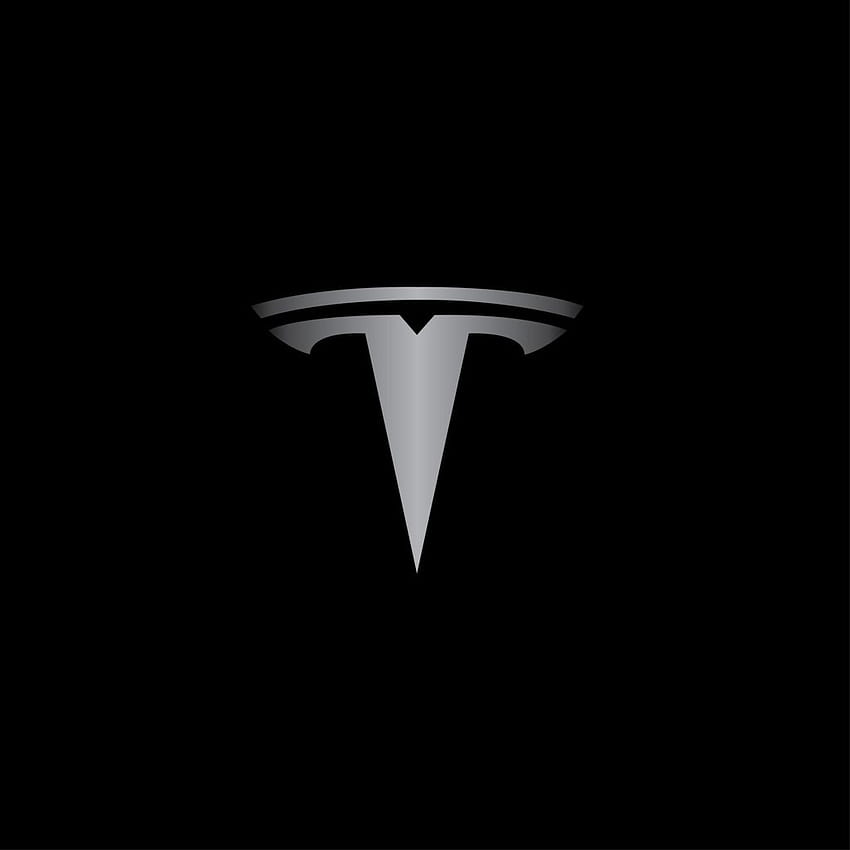
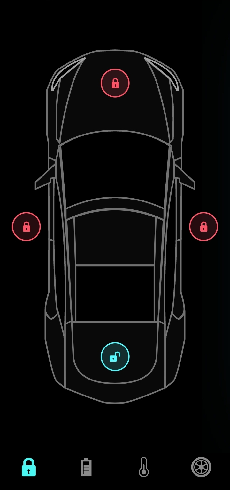
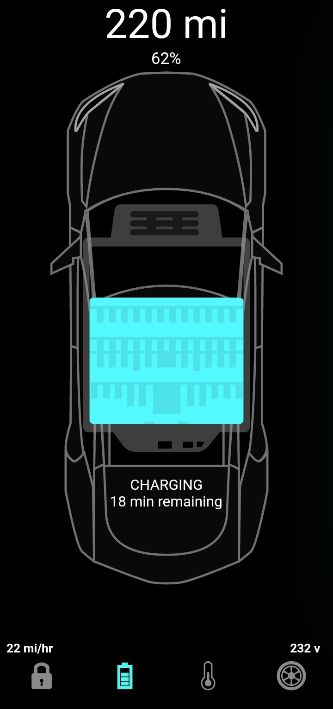
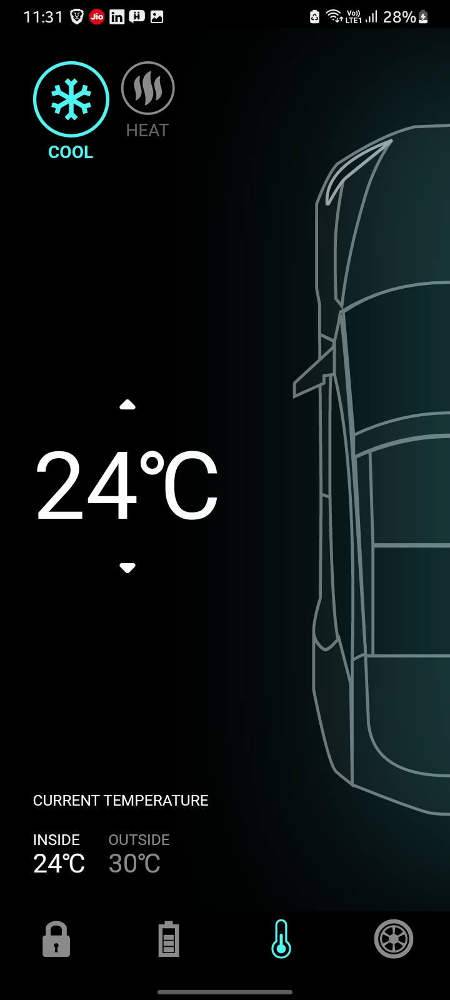
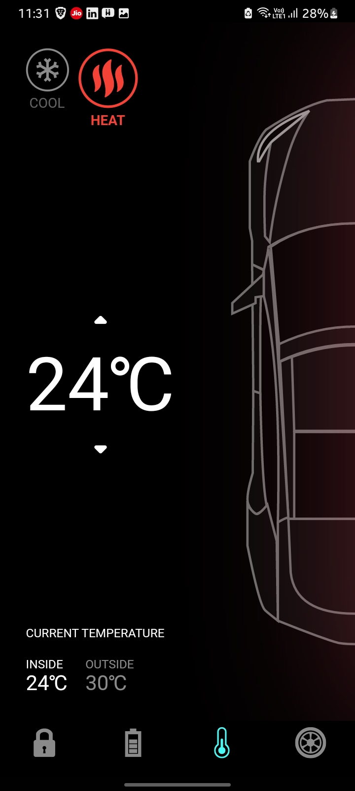
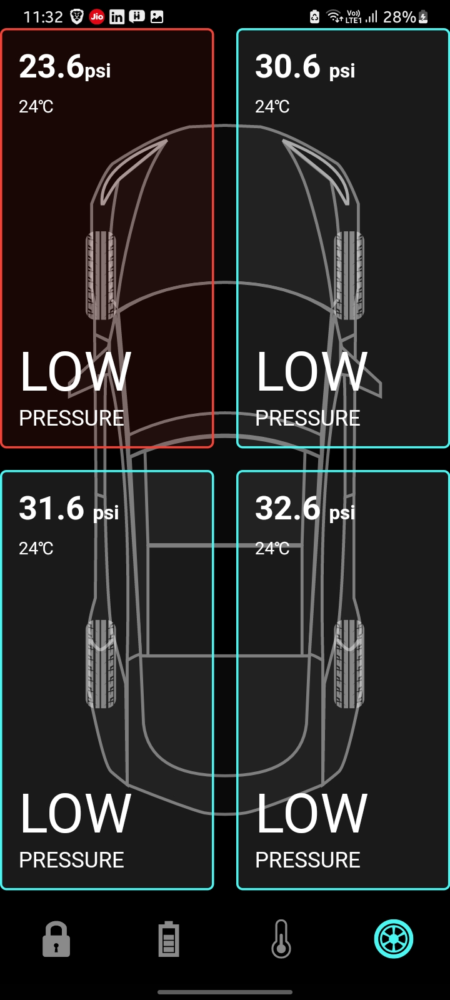

# Tesla Flutter App

 

Tesla is a sleek and interactive Flutter app designed to showcase the capabilities of Flutter for building stunning UIs and animations. With its captivating design and smooth animations, Tesla App sets out to provide a seamless user experience that reflects the innovation and elegance associated with the Tesla brand.

## Features

- Cutting-edge UI design with Tesla branding.
- Engaging animations that enhance user interaction.
- User-friendly navigation and intuitive layout.
- Responsive design that adapts to various device sizes.

## Screenshots

## Connect with Me
Find me on LinkedIn: [Yuvaraj R Mathapati](https://www.linkedin.com/in/yuvaraj-mathapati-522928212)

